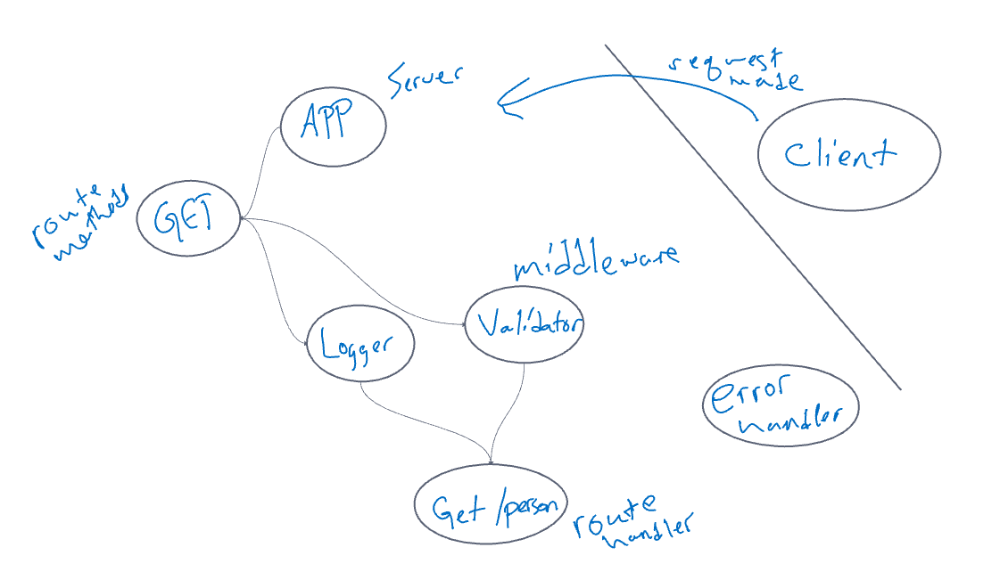

# Basic Express Server

Created by Justin Hamerly

## Installation

Dependencies: dotenv, express, jest, supertest\
install with npm install

## Problem Domain

Build a express server deployed to heroku that employs a get request, middleware, error handlers and tests.

## Links

[heroku](https://justin-basic-express-server.herokuapp.com/)\
[github](https://github.com/JustinHamerly/basic-express-server)

## UML

## Routes

Method: GET

* Path: /person
* Expects a query string from the user with a “name” property
* When present, output JSON to the client with this * shape: { name: "name provided" }
* Without a name in the query string, force a “500” error
